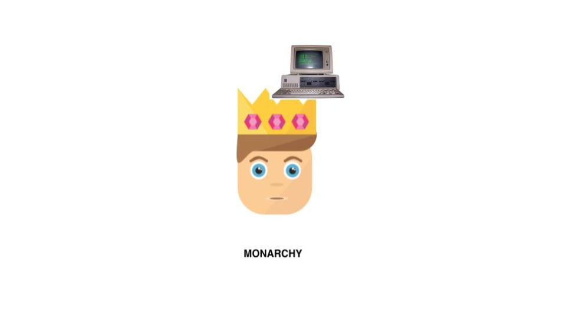

# Advies

> Het advies raakt de volgende competenties: Analyse, Advies en Oordeelsvorming

Als ik deze stage opdracht opnieuw zou maken zou ik het anders aanpakken. De blockchain komt niet tot zijn recht omdat de applicatie alsnog centraal is. De vraag voor de Slack integratie maakt het _niet_ decentralized.

De data die er nu opgeslagen wordt kan zeker wel op de blockchain alleen nu worden er emailadressen als identifier gebruikt. Als je een decentrelized applicatie zou maken die zelf met het smart contract praat is de identifier een wallet. Dit is zoals het hoort, deze zijn 100% uniek en van 1 gebruiker. Om dit te realiseren moet een gebruiker een eigen wallet hebben en een browser die het ondersteund, bijvoorbeeld: Chrome met de [metamask][1] extensie. Dit is een extensie die als tussenman tussen Chrome en Ethereum zit.

Deze extensie levert een wallet aan applicaties die daar om vragen, je moet hier wel voor inloggen (met bijvoorbeeld je private key) of een nieuwe genereren. Het nadeel hiervan is, is dat er dus verplicht een extensie te installeren. Ook is hier geen gebruik van single signon. Als ik op een nieuwe computer mijn oude account wil gebruiken gaat dit alleen door opnieuw mijn private keys te importeren.

Als je je private key kwijt bent kan je deze ook op geen enkele manier terug krijgen, er is geen "reset password" optie. Je private key is _de sleutel_ tot alles, als deze gestolen wordt is dit ook echt een probleem. Dan kunnen de dieven overal bij. Dit zal echter niet snel gebeuren omdat je private key alleen offline opgeslagen zou moeten zijn en dus niet online. Ook komt je private key niet voor in database dumps met accounts, dit is natuurlijk een pluspunt.

Door het ontbreken van de wallets per gebruiker is het vertrouwen er niet. Hierdoor is de keuze gemaakt dat niemand bonussen direct kan geven via het smart contract maar enkel via de API. Hierdoor haal je de kracht weg van het smart contract. Er is 1 wallet (die van de API) die wijzingen kan doen, alle andere kunnen alleen dingen uitlezen. Dit maakt weer een monarchie, er is 1 iemand die de macht heeft en dingen kan wijzigen.

De bedoeling van blockchain juist is een data democratie. Dit is een systeem waar de meerderheid het eens moet zijn over de juistheid van de data.

## Waarom wel

Inzichtelijk

Immutable

Decentrelized

## Waarom niet

Wordt niet goed gebruikt: geen wallets etc

Traag

Voegt geen waarde toe

Duur - meerdere vms

## Referenties

[Cryptokitties](https://www.cryptokitties.co)

[Web3 – The Decentralized Web](https://blockchainhub.net/web3-decentralized-web/)

[web3j](http://web3j.io)

[1]: https://metamask.io/
