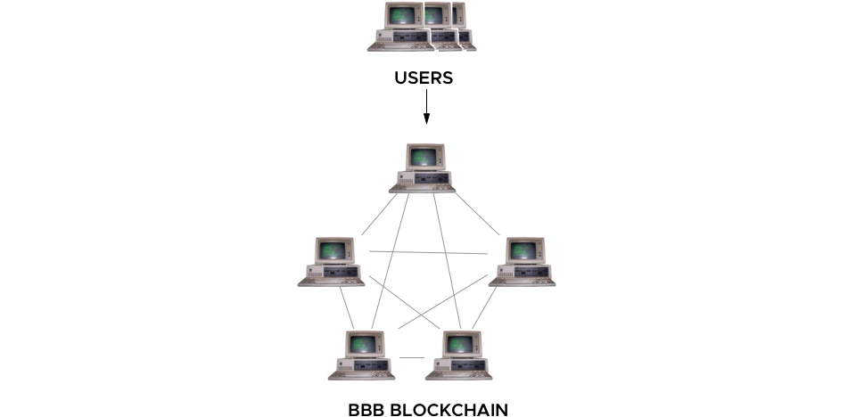

# Advies

> Het advies raakt de volgende competenties: Analyse, Advies en Oordeelsvorming

Als ik deze stage opdracht opnieuw zou maken zou ik het anders aanpakken. De blockchain komt niet tot zijn recht omdat de applicatie alsnog centraal is. De vraag voor de Slack integratie maakt het _niet_ decentralized omdat Slack een centralized applicatie is.

De data die er nu opgeslagen wordt kan zeker wel op de blockchain alleen nu worden er e-mailadressen als identifier gebruikt. Als je een decentralized applicatie zou maken die zelf met het smart contract praat is de identifier een wallet. Dit is zoals het hoort, deze zijn 100% uniek en van 1 gebruiker. Om dit te realiseren moet een gebruiker een eigen wallet hebben en een browser die het ondersteund, bijvoorbeeld: Chrome met de [metamask][1] extensie. Dit is een extensie die als tussenman tussen Chrome en Ethereum zit.

Deze extensie levert een wallet aan applicaties die daar om vragen, je moet hier wel voor inloggen (met bijvoorbeeld je private key) of een nieuwe genereren. Het nadeel hiervan is, is dat er dus verplicht een extensie geinstalleerd moet zijn. Ook is hier geen gebruik van single sign-on. Omdat je data/account niet centraal opgeslagen staat moet je zelf overal je private key gebruiken. Dit betekend dus dat als ik op een nieuwe computer mijn oude account wil gebruiken gaat dit alleen gaat door opnieuw mijn private keys te importeren.

Als je de private key kwijt bent kan je deze ook op geen enkele manier terug krijgen, er is geen "reset password" of "forgot password" optie. Je private key is _de sleutel_ tot alles, als deze gestolen wordt is dit ook echt een probleem. Je kan dus niet je wachtwoord veranderen want die is er niet. Je kan ook niet je private key veranderen, deze zal altijd hetzelfde blijven. Als de dieven je private key hebben gestolen kunnen ze ook overal bij.

Dit zal echter niet snel gebeuren omdat je private key alleen offline opgeslagen zou moeten zijn en dus niet online. Jij bent als enige die de private key heeft, geen online service. Hierdoor kan er dus niet een centrale plek gehacked worden en zo tientalle gegevens uitgelekt worden van personen. Dit gebeurt nu wel met account databases; zie [1.4 Billion Clear Text Credentials Discovered in a Single Database][2].

Door het ontbreken van de wallets per gebruiker is het vertrouwen er niet. Hierdoor is de keuze gemaakt dat niemand bonussen direct kan geven via het smart contract maar enkel via de API. Hierdoor haal je de kracht weg van het smart contract. Er is 1 wallet (die van de API) die wijzingen kan doen, alle andere kunnen alleen dingen uitlezen. Dit maakt weer een monarchie, er is 1 iemand die de macht heeft en dingen kan wijzigen.

De bedoeling van blockchain juist is een data democratie. Dit is een systeem waar de meerderheid het eens moet zijn over de juistheid van de data. Dat gebeurt nu nog wel, er zijn meerdere computers die het er over eens zijn maar er is maar 1 iemand die een wijziging mag maken, vandaar de term monarchy.

Wat je wil is dat er vanuit een decentralized applicatie direct contact wordt opgenomen met het smart contract. Deze maakt dan een wijziging en wordt geaccepteerd door de meerderheid. Zo ontstaat een democratie en is niet 1 partij verantwoordelijk. Om dus een decentralized applicatie te realiseren zal je een web applicatie moeten maken met web3 ondersteuning. Dit is fundamenteel anders dan wat de wens was van Info Support, die wouden ondersteuning met Slack.

De huidige situatie is een combinatie van beide. De blockchain is een democratie maar om daar te komen is er een monarchy. Wat je wil is een architectuur waar niemand volledig de baas is, een architectuur zonder koning! Zie het diagram hieronder voor de huidige situatie. Met Slack zal dit nooit anders kunnen. Wel kan er voor gekozen worden om Slack niet te ondersteunen en alleen een webapplicatie te maken. Door deze keuze te maken kan er met volledige democracy een puntensysteem gemaakt worden.

Als er gebruikt gemaakt wordt van de wallet en deze als identifier gebruiken kunnen collega's onderling elkaars adressen uitwisselen. Dan maak je punten over naar het adres en dit doe je rechtstreeks op de blockchain. Op deze manier zit er niemand tussen en komt de blockchain echt tot zijn recht. In het diagram hieronder zie je daardoor ook geen koning. De applicatie zal dan toegankelijk zijn via het web en maakt gebruik van de [metamask][1] plugin.

## Voor- en nadelen

De blockchain is geen holy grail die alles oplost, het heeft voor- en nadelen. Hieronder heb ik een overzichtje gemaakt. Deze voor- en nadelen zijn in de context van mijn stage opdracht.

### Voordelen

#### Inzichtelijk

Omdat de blockchain publieke toegankelijk is kan iedereen zijn eigen "front-end" maken met directe toegang tot de data. Hier is geen goedkeuring of wat dan ook voor nodig, het is gewoon publiekelijk beschikbaar.

#### Decentrelized

Als er een node uitvalt is het niet erg, er zijn nog andere die precies dezelfde data hebben. Zodra de node weer online komt kan die zichzelf updaten naar de versie waar de andere nodes op zitten. Op die manier is deze oplossing robuuster. Dit is ook haalbaar zonder blockchain, dan heb je meerdere instanties draaien van de API en een loadbalancer.

### Nadelen

#### Wordt niet goed gebruikt: geen wallets

Door de architectuur wordt de blockchain niet goed gebruikt. Met de eisen van Info Support kan het nooit goed tot zijn recht komen, nu wordt het gebruikt als publieke database terwijl het meer is dan dat.

#### Traag

Door de eis dat het geintegeert moet zijn in Slack is dit een nadeel. Slack verwacht binnen 3 seconde een reactie op een webhook call en dan kan je daarna nog 30 minuten reageren. Als een transactie dus langer zal gaan duren dan dat kan er geen feedback meer gegeven worden aan de eindgebruiker.

#### Weinig toegevoegde waarde

Omdat het niet goed wordt gebruikt is er ook weinig toegevoegde waarde.

#### Duur

Omdat de blockchain decentralized is betekend dit dat er niet 1 server is maar meerdere. In mijn stage opdracht is er een totaal van 3 nodes die draaien, dit zijn dus 3x zoveel VM's als dat je gewoon 1 database hebt draaien. Dit is dus 3x zo duur.

## Referenties

[Cryptokitties](https://www.cryptokitties.co)

[Web3 – The Decentralized Web](https://blockchainhub.net/web3-decentralized-web/)

[web3j](http://web3j.io)

[1]: https://metamask.io/
[2]: https://medium.com/4iqdelvedeep/1-4-billion-clear-text-credentials-discovered-in-a-single-database-3131d0a1ae14
