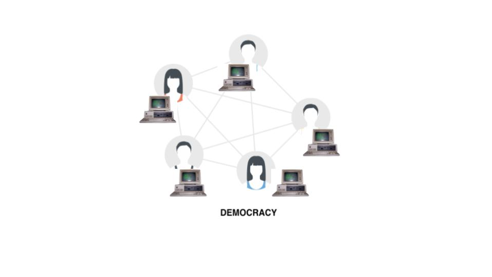

# Advies

> Het advies raakt de volgende competenties: Analyse, Advies en Oordeelsvorming

Als ik deze stage opdracht opnieuw zou maken, zou ik het anders aanpakken. De blockchain komt niet tot zijn recht omdat de applicatie alsnog gedeeltelijk centraal is. De vraag voor de Slack integratie maakt het _niet_ decentraal omdat Slack een centrale applicatie is.

De data die er nu opgeslagen wordt, kan zeker wel op de blockchain, alleen worden er nu e-mailadressen als identifier gebruikt. Als je een decentrale applicatie zou maken die zelf met het smart contract praat, is de identifier een wallet, dit is de enige manier waarop iemand geïdentificeerd kan worden. Om dit te realiseren moet een gebruiker een eigen wallet hebben en een browser die het ondersteunt, bijvoorbeeld: Chrome met de [metamask][1] extensie. Dit is een extensie die als tussenman tussen Chrome en Ethereum staat.

###### Figuur 1 - Ethereum, Metamask & Chrome

Deze extensie levert een wallet aan applicaties die daar om vragen. Je moet hier wel voor inloggen (met bijvoorbeeld je private key) of een nieuwe genereren. Het nadeel hiervan, is dat er dus verplicht een extensie geïnstalleerd moet zijn. Ook is hier geen gebruik van single sign-on. Omdat je data/account niet centraal opgeslagen staat, moet je zelf overal je private key gebruiken. Dit betekent dus dat als ik op een nieuwe computer mijn oude account wil gebruiken, dit alleen gaat door opnieuw mijn private keys te importeren.

Als je de private key kwijt bent, kan je deze ook op geen enkele manier terug krijgen want er is geen "reset password" of "forgot password" optie. Je private key is _de sleutel_ tot alles; als deze gestolen wordt is dit ook echt een probleem. Je kan je wachtwoord dus niet veranderen want dat is er niet. Ook je private key kan je niet veranderen, deze zal altijd hetzelfde blijven. Als de hackers je private key hebben gestolen kunnen ze dus ook overal bij.

Dit zal echter niet snel gebeuren omdat je private key alleen offline opgeslagen zou moeten zijn. Jij bent de enige die de private key heeft. Je private key staat dus niet ergens online opgeslagen. Hierdoor kan er geen centrale plek gehackt worden en zo tientallen (miljoenen) gegevens uitlekken van personen. Dit gebeurt nu wel met account databases; zie [1.4 Billion Clear Text Credentials Discovered in a Single Database][2].

Door het ontbreken van de wallet per gebruiker is het vertrouwen er niet. Een wallet is de enige manier waarop je iemand uniek kan identificeren op de blockchain. Er wordt geen gebruikt van wallets. Daardoor is er voor gekozen om niemand toe te staan om direct mutaties uit te laten voeren via het smart contract. Dit kan alleen via de API. Hierdoor haal je de kracht weg van het smart contract. Er is 1 wallet (die van de API) die wijzingen kan doen; alle andere kunnen alleen data uitlezen. Dit maakt weer een monarchie. Er is namelijk 1 iemand die de macht heeft en data kan wijzigen, bijvoorbeeld een bonus toekennen.

###### Figuur 2 - Monarchie systeem

De bedoeling van blockchain is een democratie. Dit is een systeem waar de meerderheid het eens moet zijn. Dat gebeurt nu nog wel, er zijn meerdere machines die het eens zijn. Alleem is er maar één iemand die wijzigingen mag maken, de API. Vandaar de term monarchie.

Wat je wil, is dat er vanuit een decentrale applicatie, direct contact wordt opgenomen met het smart contract. Dit is een geprogrammeerde overeenkomst die vastgesteld is in de blockchain. Deze maakt dan een wijziging en wordt geaccepteerd door de meerderheid. Zo ontstaat een democratie en is niet één partij verantwoordelijk. Om dus een decentrale applicatie te realiseren, zal je een applicatie moeten maken die direct in verbinding staat met het smart contract. Dit is fundamenteel anders dan wat de wens was van Info Support. Zij wilden namelijk ondersteuning van Slack, maar dit is een centrale applicatie. Daardoor zal dit niet kunnen.

###### Figuur 3 - Democratie systeem

De huidige situatie is een combinatie van beide. De blockchain is een democratie, maar om daar te komen is er een monarchie. Wat je wil, is een architectuur waar niemand volledig de baas is, een architectuur zonder koning! Zie figuur 4 voor de huidige situatie. Met Slack zal dit nooit anders kunnen omdat Slack een centrale applicatie is die beheerd wordt door Slack Technologies, Inc.. Wel kan er voor gekozen worden om Slack niet te ondersteunen en alleen een webapplicatie te maken. Door deze keuze te maken, kan er met volledige democratie een puntensysteem gemaakt worden.

###### Figuur 4 - Architectuur monarchie

Als er gebruik gemaakt wordt van wallets, dan zijn dit de identifiers. Deze adressen wisselen collega’s dan onderling uit. Bij het geven van een bonus, voer je het desbetreffende adres in waar de punten heen moeten. Dit wordt rechtstreeks via de blockchain verwerkt. Hier zit dus geen entiteit meer tussen. In figuur 5 zie je dus ook geen koning meer. Een applicatie die dit kan, zal gebruik moeten maken van de [metamask][1] plug-in en dus draaien in een browser die wallets ondersteunt.

###### Figuur 5 - Architectuur democratie

## Voor- en nadelen

De blockchain is geen silver bullet die alles oplost, het heeft voor- en nadelen. Hieronder heb ik een overzicht gemaakt in de context van mijn stageopdracht.

### Voordelen

#### Inzichtelijk

Omdat de blockchain publiek toegankelijk is, kan iedereen zijn eigen "front-end" maken met directe toegang tot de data. Hier is geen goedkeuring of wat dan ook voor nodig, het is gewoon publiekelijk beschikbaar.

#### Decentraal

Wanneer een machine uitvalt is het niet erg, dan zijn nog andere machines die precies dezelfde data hebben. Zodra de machine weer online komt, kan die zichzelf updaten naar de versie waar de andere machines op zitten. Op die manier is deze oplossing robuuster. Dit is ook haalbaar zonder blockchain, dan heb je meerdere machines draaien van de API en een load balancer. Op die manier blijft de API ook werken bij uitval van één (of meerdere) machines.

### Nadelen

#### Wordt niet goed gebruikt: geen wallets

Door de architectuur wordt de blockchain niet goed gebruikt. Met de eisen van Info Support kan het nooit goed tot zijn recht komen. Nu wordt het gebruikt als publieke database terwijl het meer is dan dat.

#### Traag

Door de eis dat het geïntegreerd moet zijn in Slack, is dit een nadeel. Slack verwacht binnen 3 seconden een reactie op een webhook call en dan kan je daarna nog 30 minuten reageren op de `response_url`¹. Als een transactie dus langer zal gaan duren dan dat, kan er geen feedback meer gegeven worden aan de eindgebruiker.

¹ [Slash Commands | Sending delayed responses | Slack](https://api.slack.com/slash-commands#responding_response_url)

#### Weinig toegevoegde waarde

Aangezien het niet goed wordt gebruikt, is er ook weinig toegevoegde waarde.

#### Duur

De blockchain decentraal. Dit betekent dat er niet één machine is maar meerdere. In mijn stage opdracht is er een totaal van 3 machines gebruikt. Dit is dus 3 keer zoveel in vergelijking met een “conventionele” centrale single-machine oplossing.

## Conclusie

Voor dit project zou ik de blockchain niet aanraden. Deze biedt te weinig extra's waardoor het de kosten niet kan verantwoorden. Door de nieuwigheid zijn er weinig mensen met kennis van blockchain. Doordoor verloopt het ontwikkelen minder snel en dus duurder. Ook het draaien van een eigen blockchain kost extra omdat er meerdere machines nodig zijn. Dit is veel makkelijker/eenvoudiger/goedkoper te doen met een centrale website, API en database.

Als je de applicatie dus zonder blockchain bouwt zal die sneller klaar zijn door de in-house kennis van Info Support. Dit zal ook goedkoper zijn om in productie te draaien omdat die maar 1 machine nodig heeft. Als het decentrale het hoofdaspect is van de applicatie, zal alles er omheen ook in die trend gemaakt moeten worden. Het komt er op neer, als je er voor kiest, moet je er ook 100% voor gaan om alle voordelen eruit te halen.

## Referenties

[Cryptokitties](https://www.cryptokitties.co)

[Web3 – The Decentralized Web](https://blockchainhub.net/web3-decentralized-web/)

[web3j](http://web3j.io)

[1]: https://metamask.io/
[2]: https://medium.com/4iqdelvedeep/1-4-billion-clear-text-credentials-discovered-in-a-single-database-3131d0a1ae14
