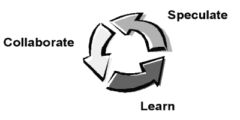
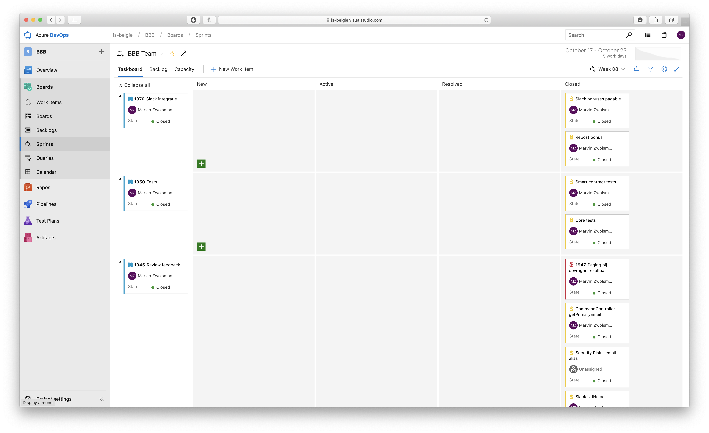
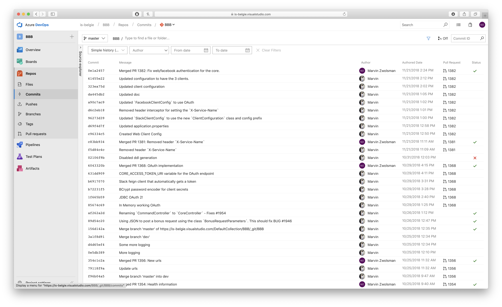
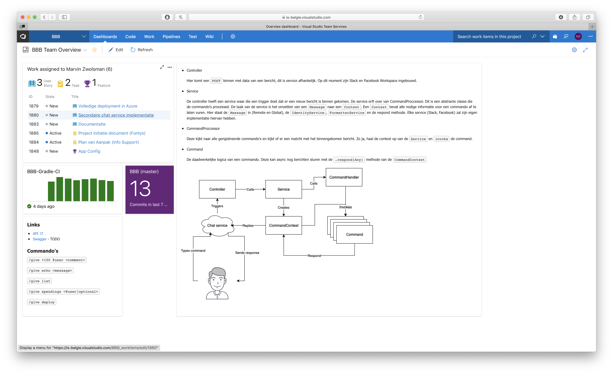
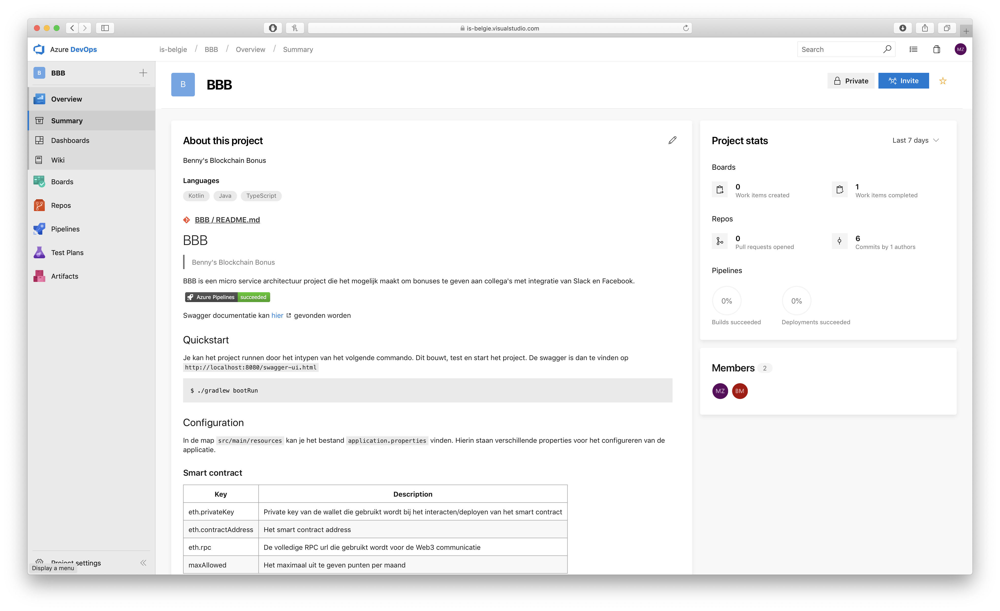
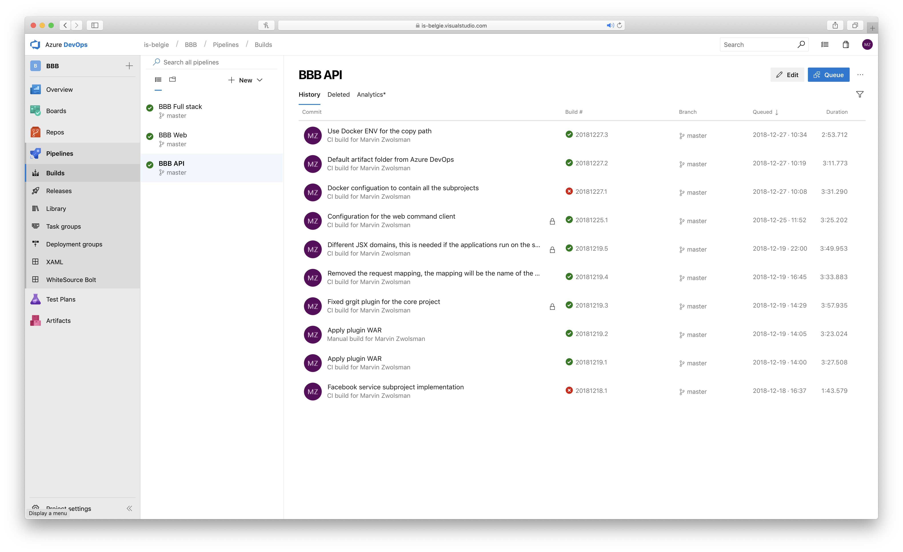
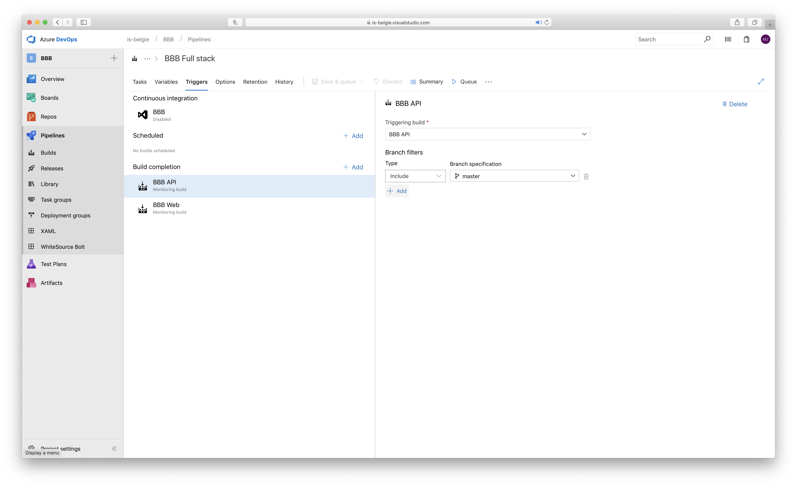
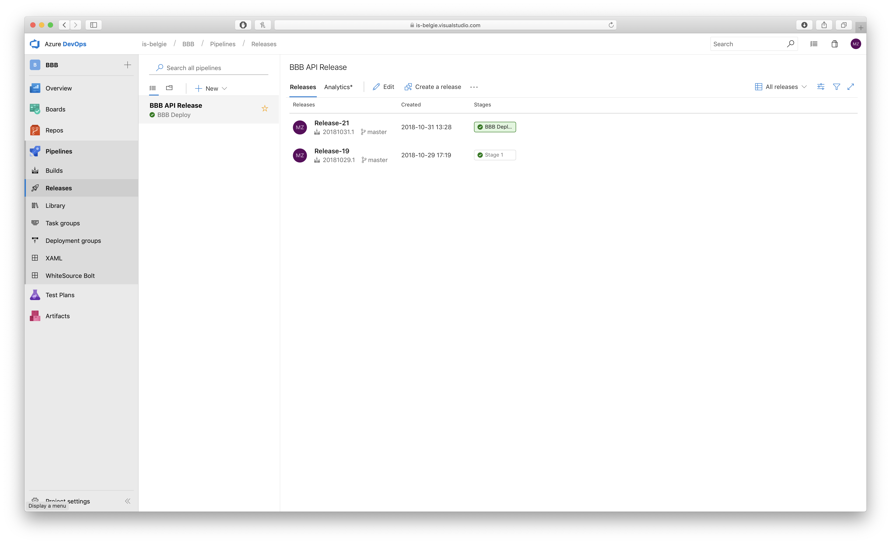

# Beheer

## Agile - ASD



Als project methode is er gebruik gemaakt van het [ASD](https://nl.wikipedia.org/wiki/Adaptive_Software_Development) model. ASD staat voor _Adaoptive Software Development_, dit is een agile methode. Er voor een agile methodiek gekozen omdat de requirements nog niet helemaal duidelijk waren. Door iteratief te werk te gaan heeft de klant altijd een prototype die werkt.

### Sprints



Er is gebruik gemaakt van sprints van 1 week op een uitzondering van week 17. Die sprint duurde 2 weken i.v.m. kerst + oud & nieuw. Na elke sprint hadden we een _Learn_ moment, een terugblik op de sprint. Wat ging er goed, wat ging er fout en hoe gaan we het deze sprint aanpakken (_Speculate_). De planningen werden vastgelegd in [Azure DevOps](#Azure-DevOps).

## Azure DevOps

Azure DevOps is een omgeving waar alle tooling bij elkaar komt voor je project beheer.

### Git



Het versiebeheersysteem wat gebruikt is heet Git. Dit is een decentrelized manier van versiebeheer. In Azure DevOps heb je verschillende repositories (BBB - Hoofd applicatie en proof of concepts).

De repository heeft een `master` branch, deze heeft een volledig werkende versie ten aller tijden. Elke feature wordt een nieuwe branch gebaseerd op de `master`. Uiteindelijk wordt er een pull request (`PR`) gemaakt. Deze PR wordt gecontroleerd en gemerged in de `master`. Deze wordt dan automatisch gebuild. Zie Pipelines/Build.

### Dashboard



Om het inzichtelijk te maken naar andere mensen toe wat ik aan het doen ben heb ik een dashboard ingericht. Dit dashboard bestaat uit verschillende blokjes. De blokjes die ik heb ingericht zijn:

- Taak overzicht, welke taken ik daadwerkelijk mee bezig ben
- Build statussen (gefaald of niet)
- Release statussen (Welke release er nu live is)
- Een lijst van commando's en waar je de Swagger kan vinden
- Hoe de applicatie opgebouwd is en in elkaar steekt met uitleg.

### Readme



Er is een `README.md` in de repository waar benodigde informatie in staat van de applicatie. Welke configuratie er allemaal is, de build geschiedenis en hoe je de applicatie moet starten.

### Pipelines

Een pipeline is een groep taken die uitgevoerd moet worden om een doel te behalen. De 2 doelen die ik heb binnen mijn project zijn het bouwen van de applicatie en het releasen (deployen) van de applicatie in de Azure Cloud. Voor het builden zijn 3 pipelines opgezet en voor het releasen 1.

#### Build - API



De build pipeline doet een 4-tal taken. Deze pipeline wordt uitgevoerd na elke commit op de `master`.

1. Source code ophalen (een git checkout)
2. Gradle wrapper starten met de taak `build`. Deze gaat per project een build actie doen. Om een build actie te mogen doen zal er eerst een test gedraaid worden, dit zijn unit tests. Deze worden dus automatisch gedraaid.
3. De files kopieren die `**/*.war` en `**/*.sql` matchen, dit `core.war`, `facebook.war`, `slack.war`, `web.war` en de `schema.sql`. Deze worden als artifact gezien.
4. De artifacts zippen en publishen, zo heb je aan het einde van de build een `drop.zip`. Deze kan gebruikt worden in andere pipelines. Deze wordt gebruikt in de `BBB Full stack` pipeline.

#### Build - WEB

De build van een react project is anders dan van een gradle project. Dit project maakt gebruik van de node package manager. In het bestand `package.json` staan alle packages die gebruikt worden. Deze pipeline bestaat uit 5 taken. Als er een commit is gemaakt op de `master` branch zal deze pipeline automatisch draaien.

1. Source code ophalen (een git checkout)
2. Een `npm install` doen. Dit installeerd alle packages gespecifieerd in de `package.json`.
3. Een `npm build` voor het daadwerkelijk bouwen van het project. De output komt in de `build` folder.
4. De files kopieren die in de `build` map staan.
5. Het publishen van de artifact. Hier wordt ook een `drop.zip` van gemaakt. Deze kan ook gebruikt worden in andere pipelines. Ook deze wordt gebruikt in de `BBB Full stack` pipeline.

#### Build - Full Stack


Deze pipeline is voor de volledige applicatie. Omdat de volledige applicatie bestaat uit 2 aparte projecten is dit nodig. Deze pipeline heeft 6 stappen om uit te voeren. Het einddoel van deze pipeline is een docker image die gedraait kan worden in de Azure Cloud. Deze zal dan de combinatie van de 5 projecten hebben. In tegenstelling tot de andere pipelines die automatisch draaien als er een commit is gedaan op een master branch heb je hier de trigger van andere pipelines. Omdat deze pipeline afhankelijk is van de api en de web pipelines wordt deze automatisch gedraaid als er 1 van de 2 klaar is.

1. Download de artifact van de api pipeline
2. Download de artifact van de web pipeline
3. De artifact van de api pipeline uitpakken
4. De artifact van de web pipeline uitpakken
5. De docker image bouwen genaamd `bbb`. Deze heeft de tag `latest` maar ook de git tags. Dit is zodat ik altijd een optie heb om een specifieke versie terug te zetten.
6. De image pushen naar de repository. In azure kan je een eigen repository aanmaken. De repository die gebruikt wordt heet `bbbimages`.

#### Release



Releasen is het online zetten van een versie, in mijn geval de laatste versie. De omgeving die ik heb is een productie omgeving, hier wordt de laatste nieuwe docker image gedraaid. Deze docker image draait in een _Azure Web Service_. Omdat Azure DevOps zo goed samen werkt met de Azure Cloud omgeving was het configureren heel makkelijk. Er is maar 1 stap, de _Azure App Service Deploy_. Deze is geconfigureerd om de `bbbimages` container registery te gebruiken voor het ophalen van de `bbb` image. Deze wordt dan gepusht naar de Web Service en online gezet.

Als dit gelukt is, is de release succesvol afgerond en staat er een nieuwe versie online. De huidige versie kan je dan checken op het [info endpoint](http://bbb-apiv2.azurewebsites.net/core/actuator/info)

## Swagger


Om de API inzichtelijk te maken naar andere ontwikkelaars toe heb ik gekozen voor Swagger. Dit is een user interface met informatie over de API's, welke parameters, waar ze staan en wat de modellen zijn die ze returnen. Je kan ook in plaats alles proberen (in de browser). Hier zie je de volgende controllers: `WebController`, `CoreController`, `SlackController` en de `FacebookController`.

## Actuator

Actuator wordt gebruikt om interne informatie over de applicatie beschikbaar te stellen aan de buitenwereld. Ik heb informatie over de versie onder het `/info` endpoint, over de envirnment variables op de `/env` en over de health op de `/health` endpoint.

Het info endpoint bevat informatie over de build. Hieronder zie je een voorbeeld.

```json
{
  "build": {
    "version": "1.0.0.43d438a",
    "artifact": "core",
    "name": "core",
    "group": "com.infosupport",
    "time": "2018-12-27T09:34:56.476Z"
  }
}
```

De environment kan je de variables zien die gebruikt worden. Secrets en wachtworden worden gemaskt met \*\*\*. Hier kan je dus zien welke daadwerkelijk configuratie er gebruikt wordt en waar die vandaan komt (process argument, properties file, etc.). Door dit inzichtelijk te maken weet je zeker welke waardes er gebruikt worden op productie.

De health endpoint is om te zien of de applicatie werkt na behoren. Als dit niet zo is zal hier `status: down` komen te staan met een eventuele reden (database niet bereikbaar o.i.d.).

```json
{
  "status": "UP"
}
```

## Referenties

[Adoptive Software Development](http://www.exa.unicen.edu.ar/catedras/agilem/cap23asd.pdf)

[Git](https://git-scm.com)

[Azure DevOps](https://azure.microsoft.com/en-us/services/devops/)

[CI](https://en.wikipedia.org/wiki/Continuous_integration)/[CD](https://en.wikipedia.org/wiki/Continuous_delivery)

[Swagger](https://swagger.io)

[Spring Boot Actuator](https://docs.spring.io/spring-boot/docs/current/reference/html/production-ready-endpoints.html)
