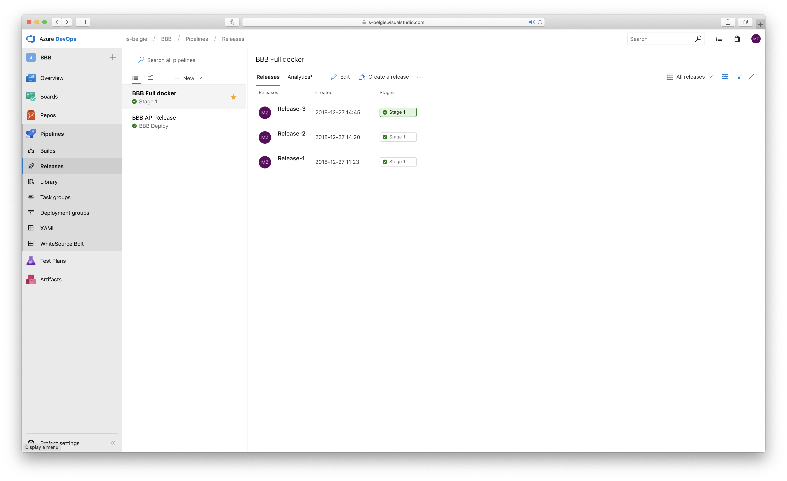
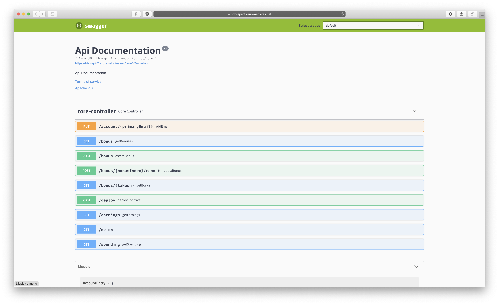

# Beheer

## Agile - ASD


Als project methode is er gebruik gemaakt van het [ASD](https://nl.wikipedia.org/wiki/Adaptive_Software_Development) model. ASD staat voor _Adaoptive Software Development_, dit is een agile methode. Er voor een agile methodiek gekozen omdat de requirements nog niet helemaal duidelijk waren. Door iteratief te werk te gaan heeft de klant altijd een prototype die werkt.

### Sprints


Er is gebruik gemaakt van sprints van 1 week op een uitzondering van week 17. Die sprint duurde 2 weken i.v.m. kerst + oud & nieuw. Na elke sprint hadden we een _Learn_ moment, een terugblik op de sprint. Wat ging er goed, wat ging er fout en hoe gaan we het deze sprint aanpakken (_Speculate_). De planningen werden vastgelegd in [Azure DevOps](#Azure-DevOps).

## Azure DevOps

Azure DevOps is een omgeving waar alle tooling bij elkaar komt voor je project beheer.

### Git


Het versiebeheersysteem wat gebruikt is heet Git. Dit is een decentrelized manier van versiebeheer. In Azure DevOps heb je verschillende repositories (BBB - Hoofd applicatie en proof of concepts).

De repository heeft een `master` branch, deze heeft een volledig werkende versie ten aller tijden. Elke feature wordt een nieuwe branch gebaseerd op de `master`. Uiteindelijk wordt er een pull request (`PR`) gemaakt. Deze PR wordt gecontroleerd en gemerged in de `master`. Deze wordt dan automatisch gebuild. Zie Pipelines/Build.

### Dashboard


Om het inzichtelijk te maken naar andere mensen toe wat ik aan het doen ben heb ik een dashboard ingericht. Dit dashboard bestaat uit verschillende blokjes. De blokjes die ik heb ingericht zijn:

- Taak overzicht, welke taken ik daadwerkelijk mee bezig ben
- Build statussen (gefaald of niet)
- Release statussen (Welke release er nu live is)
- Een lijst van commando's en waar je de Swagger kan vinden
- Hoe de applicatie opgebouwd is en in elkaar steekt met uitleg.

### Readme


Er is een `README.md` in de repository waar benodigde informatie in staat van de applicatie. Welke configuratie er allemaal is, de build geschiedenis en hoe je de applicatie moet starten.

### Pipelines

Een pipeline is een groep taken die uitgevoerd moet worden om een doel te behalen. De 2 doelen die ik heb binnen mijn project zijn het bouwen van de applicatie en het releasen (deployen) van de applicatie in de Azure Cloud. Hier zijn dus 2 pipelines voor opgezet.

#### Build


De build pipeline doet een 4-tal taken. Deze pipeline wordt uitgevoerd na elke commit op de `master`. De artifacts van de build worden dan opgeslagen en gebruikt in de release pipeline.

1. Source code ophalen (een git checkout)
2. Gradle wrapper starten met de taak `bootWar`, deze bouwt een `war` archief die gebruikt wordt in Azure.
3. De files kopieren die `/build/libs/*.*` en `src/main/resources/*.sql` matchen, dit is de `ROOT.war` en de `schema.sql`. Deze worden als artifact gezien.
4. De artifacts zippen en publishen, zo heb je aan het einde van de build een `drop.zip` die gebruikt kan worden in de releae pipeline.

#### Release



Releasen is de artifact(s) online zetten, in mijn geval op productie. De productie server is een Azure Web Service. Je geeft aan welke artifacts er gebruikt worden en van welke build. Dan heb ik 1 stage, de deploy stage. Deze bestaat uit meerdere taken; de taken zijn:

1. Stop de App Service
2. Gebruik het `schema.sql` script om de database in te richten
3. Deploy de war naar de (gestopte) App Service
4. Start de App Service

Als deze stappen doorgaan zijn is de release succesvol afgerond en staat er een nieuwe versie online. De huidige versie kan je dan checken op het [info endpoint](http://bbb-api.azurewebsites.net/actuator/info)

## Swagger



Om de API inzichtelijk te maken naar andere ontwikkelaars toe heb ik gekozen voor Swagger. Dit is een user interface met informatie over de API's, welke parameters, waar ze staan en wat de modellen zijn die ze returnen. Je kan ook in plaats alles proberen (in de browser). Hier zie je de volgende controllers: `WebController`, `CoreController`, `SlackController` en de `FacebookController`.

## Actuator

Actuator wordt gebruikt om interne informatie over de applicatie beschikbaar te stellen aan de buitenwereld. Ik heb informatie over de versie onder het `/info` endpoint, over de envirnment variables op de `/env` en over de health op de `/health` endpoint.

Het info endpoint bevat informatie over de build. Hieronder zie je een voorbeeld.

```json
{
  "build": {
    "version": "1.0.0.02106f9",
    "artifact": "bbb-api",
    "name": "bbb-api",
    "group": "com.infosupport",
    "time": "2018-10-31T12:06:21.104Z"
  }
}
```

De environment kan je de variables zien die gebruikt worden. Secrets en wachtworden worden gemaskt met \*\*\*. Hier kan je dus zien welke daadwerkelijk configuratie er gebruikt wordt en waar die vandaan komt (process argument, properties file, etc.). Door dit inzichtelijk te maken weet je zeker welke waardes er gebruikt worden op productie.

De health endpoint is om te zien of de applicatie werkt na behoren. Als dit niet zo is zal hier `status: down` komen te staan met een eventuele reden (database niet bereikbaar o.i.d.).

```json
{
  "status": "UP"
}
```

## Referenties

[Adoptive Software Development](http://www.exa.unicen.edu.ar/catedras/agilem/cap23asd.pdf)

[Git](https://git-scm.com)

[Azure DevOps](https://azure.microsoft.com/en-us/services/devops/)

[CI](https://en.wikipedia.org/wiki/Continuous_integration)/[CD](https://en.wikipedia.org/wiki/Continuous_delivery)

[Swagger](https://swagger.io)

[Spring Boot Actuator](https://docs.spring.io/spring-boot/docs/current/reference/html/production-ready-endpoints.html)
